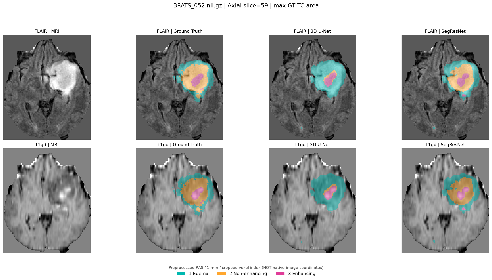
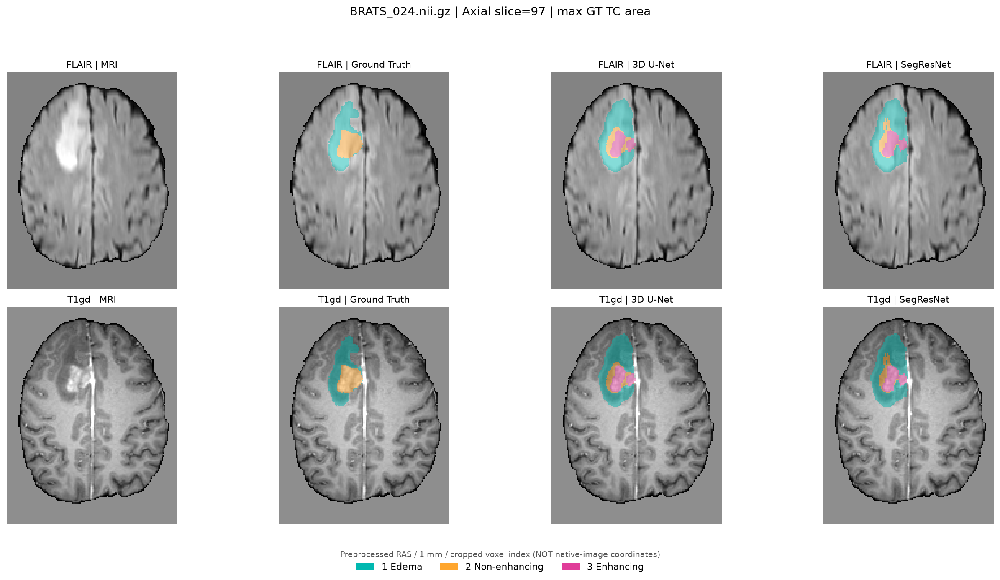

# MedSeg3D — 四模态 MRI 脑肿瘤三维分割

基于 PyTorch 和 MONAI 实现四模态 MRI 脑肿瘤分割流程，对比轻量级 3D U-Net 和 SegResNet。实验包括 NIfTI 预处理、三维 Patch 训练、全体积滑动窗口推理、WT/TC/ET 区域评价及逐病例误差分析。

数据来自 Medical Segmentation Decathlon（MSD）的 `Task01_BrainTumour`。仓库保留训练与评价代码、固定数据划分、97 例验证记录和部分病例对比图；不提供原始影像及模型权重。

## 1. 方法

- **数据**：484 例有标签四模态 MRI（FLAIR、T1、T1gd、T2）；固定分为 387 例训练、97 例验证，随机种子为 42。划分名单见 [`train_val_split.json`](outputs/splits/train_val_split.json)。
- **预处理**：统一至 RAS 方向，重采样到 1 mm，前景裁剪，补齐最小空间尺寸；按模态对非零区域做 Z-score 标准化。
- **模型**：自定义 3D U-Net（`base_channels=8`，351,484 个参数）和 MONAI SegResNet（`init_filters=8`，1,176,852 个参数）。
- **训练**：64×64×64 Patch、正负采样比例 1:1、Batch Size 1、Adam（1e-4）、Dice + Cross-Entropy，训练预算均为 60 Epoch。
- **验证**：选择验证集 Raw Mean Dice 最高的权重；FP32 滑动窗口推理，ROI 64³，overlap 0.25。

标签 0 为背景、1 为水肿、2 为非增强肿瘤、3 为增强肿瘤。复合区域定义为：WT = {1,2,3}，TC = {2,3}，ET = {3}。

具体设置和历史续训方式见 [实验复现说明](docs/REPRODUCIBILITY.md)。

## 2. 结果

固定 97 例内部验证集；每项 Dice 先按有效病例平均，Region Mean 为 WT、TC、ET 三个区域均值的宏平均。

| 指标 | 3D U-Net（Epoch 53） | SegResNet（Epoch 59） | SegResNet − U-Net |
|:--|--:|--:|--:|
| Class 1 Dice | 0.7724 | 0.7781 | +0.0058 |
| Class 2 Dice | 0.5653 | 0.5835 | +0.0181 |
| Class 3 Dice | 0.7597 | 0.7570 | −0.0027 |
| Raw Mean Dice | 0.6991 | 0.7062 | +0.0071 |
| WT Dice | 0.8897 | 0.8920 | +0.0023 |
| TC Dice | 0.7727 | 0.7891 | +0.0165 |
| ET Dice | 0.7597 | 0.7570 | −0.0027 |
| **Region Mean Dice** | **0.8074** | **0.8127** | **+0.0054** |

ET 的真实标签在 4 例中为空，因此 ET Dice 只对其余 93 例求均值；空标签病例的预测假阳性另行统计。两种模型的验证病例相同，但参数量及各轮随机 Patch 序列并非完全一致。

SegResNet 在 65/97 例的 TC Dice 上优于 U-Net，平均提升约 0.0165；但在 ET 上没有相应提升。SegResNet 参数量约为 U-Net 的 3.35 倍，不能将这一结果理解为所有指标均更优。

完整数值见 [97 例逐病例结果](results/metrics/unet60_vs_segresnet60_per_case.csv) 和 [汇总表](results/metrics/summary_97.csv)。

## 3. 分割结果与误差分析

下图是验证集中按性能差异选取的病例，均使用相同的重采样和裁剪空间。图中展示的二维切片只用于观察错误形态，数值指标由三维体积计算。

| BRATS_052：TC 漏分减少 | BRATS_024：TC 过分割 |
|---|---|
|  |  |
| TC Dice：0.4879 → 0.9023；FN：30,626 → 6,274 | TC Dice：0.6159 → 0.3620；FP：3,693 → 10,303 |

[BRATS_184](results/figures/BRATS_184_comparison.png)（召回和误报的权衡） · [BRATS_036](results/figures/BRATS_036_comparison.png)（ET 假阳性） · [BRATS_177](results/figures/BRATS_177_comparison.png)（小病灶） · [BRATS_339](results/figures/BRATS_339_comparison.png)（两模型接近）。

病例的三维误报/漏分体素统计和具体分析见 [CASE_STUDIES.md](docs/CASE_STUDIES.md)。

## 4. 项目结构

```text
MedSeg3D/
├── models/unet3d.py                     # 轻量级 3D U-Net
├── scripts/
│   ├── train_unet_baseline_40.py       # U-Net 历史训练脚本（40+20 轮）
│   ├── train_segresnet_60.py           # SegResNet 训练
│   ├── compare_unet60_vs_segresnet60.py
│   ├── visualize_unet_segresnet_cases.py
│   ├── verify_results.py              # 无 GPU 的结果复核
│   └── legacy/                         # Loss 对照及早期评价脚本
├── outputs/splits/train_val_split.json
├── results/figures/                    # MRI 结果图
├── results/metrics/                    # 逐病例与汇总指标
├── docs/                               # 实验配置与病例分析
└── data/README.md                      # 数据准备说明
```

## 5. 运行

在项目根目录配置 Python 环境。依赖清单见 `requirements.txt`；PyTorch 的 CUDA 版本按照 [官方安装说明](https://pytorch.org/get-started/locally/) 选择。原始实验使用 RTX 3050 Laptop 4 GB。历史环境的准确包版本没有冻结记录，不保证安装最新依赖即可复现相同训练轨迹。

```bash
pip install -r requirements.txt
python scripts/check_public_release.py
python scripts/verify_results.py
```

以上检查不需要 MRI 或 GPU。全体积推理需要按 [数据准备说明](data/README.md) 下载 `Task01_BrainTumour`，并将原实验权重放入 `outputs/checkpoints/`：

```text
unet_baseline_40_fast_best.pth
segresnet_baseline_60_fast_best.pth
```

数据和权重齐全后：

```bash
python scripts/check_project.py
python scripts/compare_unet60_vs_segresnet60.py
python scripts/visualize_unet_segresnet_cases.py
```

已公布的结果表可直接校验；没有原始权重时，可以运行训练脚本重新训练，但不能直接重现上述两份 Checkpoint 的逐体素预测。历史 U-Net 先训练 40 轮，再续训至 60 轮，详见 [复现说明](docs/REPRODUCIBILITY.md)。

## 6. 局限性与数据引用

本实验仅使用一次固定划分和单一随机种子，验证集也被用于选择最佳 Epoch。所有指标属于**内部验证结果**，不代表独立测试、跨中心泛化或临床诊断性能。当前尚未提供原始权重、精确依赖锁定文件及多随机种子重复实验。

数据来源：Antonelli M. et al., [*The Medical Segmentation Decathlon*](https://doi.org/10.1038/s41467-022-30695-9), *Nature Communications* 13, 4128 (2022)。MSD 原始数据及其衍生 MRI 结果图的来源、修改和 CC BY-SA 4.0 许可说明见 [图像署名](results/figures/ATTRIBUTION_AND_LICENSE.md)。图像许可不等同于 Python 代码的授权许可。
